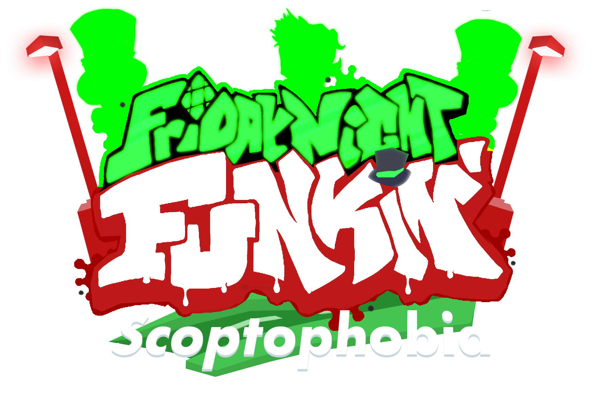

## Built on **[Kade Engine](https://github.com/KadeDev/Kade-Engine)**

FNF Links: **[itch.io page](https://ninja-muffin24.itch.io/funkin) ⋅ [Newgrounds](https://www.newgrounds.com/portal/view/770371) ⋅ [source code on GitHub](https://github.com/ninjamuffin99/Funkin)**

# Credits

### Friday Night Funkin': Scoptophobia
- [Shpeelock](https://twitter.com/Shpeelock) - Creator of Scoptophobia, Animator.
- [Bloximator](https://twitter.com/Bloximator) - Main Artist and Sprite Maker.
- [Amoory](https://twitter.com/AmooryKSArab) - Coder.
- [WildyThomas](https://twitter.com/wildythomas1233) - Main Composer and Coder.
- [KyleGFX](https://twitter.com/KyleGFX_RBLX) - Composed The Main Menu Music and Gameover Music.
- [J-Bug](https://www.youtube.com/channel/UCxrlvK42NWHotZtejEE0yKg) - Did the icon art.
- [Ronstar] - Helped with coding.

### Friday Night Funkin'
 - [ninjamuffin99](https://twitter.com/ninja_muffin99) - Programming
 - [PhantomArcade3K](https://twitter.com/phantomarcade3k) and [Evilsk8r](https://twitter.com/evilsk8r) - Art
 - [Kawai Sprite](https://twitter.com/kawaisprite) - Music

### Kade Engine
- [KadeDeveloper](https://twitter.com/KadeDeveloper) - Maintainer and lead programmer
- [The contributors](https://github.com/KadeDev/Kade-Engine/graphs/contributors)
